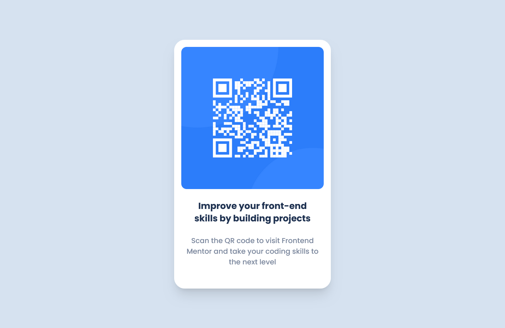

# Frontend Mentor - QR code component solution

This is a solution to the [QR code component challenge on Frontend Mentor](https://www.frontendmentor.io/challenges/qr-code-component-iux_sIO_H). Frontend Mentor challenges help you improve your coding skills by building realistic projects.

## Table of contents

- [Overview](#overview)
  - [Screenshot](#screenshot)
  - [Links](#links)
- [My process](#my-process)
  - [Built with](#built-with)
  - [What I learned](#what-i-learned)
  - [Continued development](#continued-development)
  - [Useful resources](#useful-resources)
- [Author](#author)
- [Acknowledgments](#acknowledgments)

## Overview

A QR component card made with tailwind.

### Screenshot

Mobile View

Desktop View

### Links

- Solution URL: [Add solution URL here](TO_BE_ADDED)
- Live Site URL: [Add live site URL here](https://brianhammer.github.io/qr-component/)

## My process

Opening tailwind documentation and going through the steps. Since this project doesnt use a ./src file, set the content to the index.html path in tailwind.config. Set fonts and colors used in the style-guide.md inside tailwind.config file so it can be easily accessed when developing.

Use the following command to build the project, and open the index.html file using live server.

npx tailwindcss -i ./input.css -o ./output.css --watch

### Built with

- HTML5
- Tailwind
- Flex classes
- Google fonts

### What I learned

Learned how to disable dragging on image elements to make the component feel more professional. Learned how to import fonts inside of tailwind, and add custom color classes to make development faster.

### Continued development

My solution to keeping the paragraph and header elements from exanding the card works, but not ideal when the image size must be changed. I will figure out a better solution for future components.

### Useful resources

- [Resource 1](https://stackoverflow.com/questions/70577297/tailwind-class-is-not-working-after-installed) - A solution to an issue where the styled were not working for me.

## Author

- Website - [Brian Hammer](TO_BE_ADDED)
- Frontend Mentor - [@BrianHammer](https://www.frontendmentor.io/profile/BrianHammer)

## Acknowledgments

Stack Overflow questions and solutions helped me with some difficult to figure out bugs. Various tutorials on YouTube helped me to setup google fonts with tailwind.
